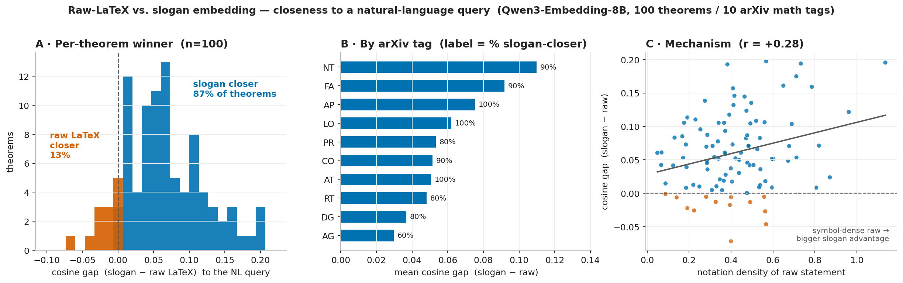

# Raw LaTeX vs. slogan embedding

**Question.** When we index a theorem for natural-language retrieval, is it better to
embed the **verbatim LaTeX statement** or an LLM-generated **slogan** (a one-sentence
NL summary)? The deployed retriever slogans everything; this experiment measures, on
real arXiv theorems, how much that choice matters and *why*.

**TL;DR.** On 100 theorems drawn from 10 papers (one per arXiv math tag), the slogan is
closer to a natural-language query than the raw LaTeX statement in **87%** of cases
(deployed asymmetric prompts; **90%** under symmetric-query prompts), by a mean cosine
margin of **+0.061**. The advantage grows with the notation density of the raw statement
(Pearson *r* = **+0.28**): symbol-dense statements embed poorly against NL, and the slogan
recovers them. Raw LaTeX wins only in a **13%** minority, concentrated in statements that
are *already prose* (little notation) or where the generated slogan drifted into
higher-abstraction jargon.



## Setup

- **Embedder.** `Qwen/Qwen3-Embedding-8B` (4096-d, L2-normalized) via the Nebius /
  TokenFactory OpenAI-compatible endpoint (`https://api.tokenfactory.nebius.com/v1/`).
- **Prompts.** The deployed asymmetric instructions: the query side gets *"Given an
  informal description of a mathematical result, retrieve the formal theorem statement
  that matches it…"*, the corpus side gets *"Represent the given math statement for
  retrieving related statement by natural language query."* Both wrapped as
  `Instruct: {task}\nQuery:{text}`.
- **Slogan / query generation.** `Qwen/Qwen3-235B-A22B-Instruct-2507`. Two independent
  calls per theorem, from the raw statement:
  - **slogan** — one concise standalone NL sentence, no LaTeX/symbols;
  - **query** — a 1–2 sentence plain-English description in a *searcher's* register,
    formulas and variable names forbidden.

### Corpus (one paper per tag, 10 statements each; frozen in `data/papers.json`)

| tag | arXiv | title |
|-----|-------|-------|
| math.AG | 2607.14055 | Open surfaces with a triangle at infinity |
| math.AT | 2607.14016 | The internal Yoneda Lemma for locally Cartesian closed ∞-categories |
| math.NT | 2607.14071 | Strongly complete sets and a conjecture of Erdős |
| math.CO | 2607.14028 | Cyclic Sieving for Staircase Plane Partitions via Crystals and Electrical Networks |
| math.PR | 2607.14087 | Stochastic Domination of Gaussian Maxima: A Resolution to the Weak Simplex Conjecture |
| math.DG | 2607.13917 | L¹-Integrability of L²-Harmonic Forms and the Hopf Conjecture |
| math.FA | 2607.14019 | Semialgebraic Dimension and Truncated Toeplitz Models for Complex Symmetric Matrices |
| math.LO | 2607.13969 | Further quantitative moduli around uniform convexity |
| math.RT | 2607.13252 | Type B Webs |
| math.AP | 2607.14080 | Recovery of Schrödinger nonlinearity from the large-data scattering behavior |

Theorem-like statements (`theorem/thm/lemma/prop/corollary/…`) are extracted from the
arXiv LaTeX source, lightly cleaned (`\label`, `\qed`, comments stripped; math kept),
and filtered to 60–1100 chars containing at least one math token. First 10 per paper.

## Method

For each theorem we embed two **corpus** representations — the raw LaTeX statement and
the slogan — and one **query**. We score under two configurations:

- **asym** — query uses the query-instruction, candidates use the corpus-instruction
  (the deployed retriever's asymmetric setup).
- **symq** — both sides use the query-instruction (symmetric).

`gap = cos(query, slogan) − cos(query, raw)`. `gap > 0` ⇒ the slogan is closer.

## Results

| config | slogan closer | mean gap (slo−raw) | median | mean cos slo / raw |
|--------|--------------:|-------------------:|-------:|-------------------:|
| **asym** (deployed) | **87 / 100** | +0.0609 | +0.0532 | 0.8055 / 0.7446 |
| **symq** (symmetric) | **90 / 100** | +0.0673 | +0.0612 | 0.8543 / 0.7870 |

Every tag favors the slogan on average:

| tag | asym: % slo-closer / mean gap | symq: % slo-closer / mean gap |
|-----|:--:|:--:|
| math.AG | 60% / +0.030 | 80% / +0.037 |
| math.AP | 100% / +0.075 | 100% / +0.082 |
| math.AT | 100% / +0.051 | 100% / +0.061 |
| math.CO | 90% / +0.052 | 70% / +0.045 |
| math.DG | 80% / +0.037 | 100% / +0.061 |
| math.FA | 90% / +0.092 | 100% / +0.106 |
| math.LO | 100% / +0.062 | 100% / +0.075 |
| math.NT | 90% / +0.110 | 90% / +0.115 |
| math.PR | 80% / +0.053 | 80% / +0.041 |
| math.RT | 80% / +0.048 | 80% / +0.048 |

### Mechanism: notation density predicts the gap

Define notation density as the fraction of a raw statement's characters that are math
(inside `$…$`/`\(…\)`/`\[…\]`) or math symbols. It correlates with the slogan advantage:

- Pearson *r*(notation density, gap) = **+0.277** (and *r*(length, gap) = −0.183).

| notation-density tercile | range | mean gap | slogan-wins |
|---|---|---:|---:|
| LOW (prose-like) | 0.05–0.33 | +0.0455 | 82% |
| MID | 0.34–0.48 | +0.0652 | 91% |
| HIGH (symbol-dense) | 0.48–1.14 | +0.0717 | 88% |

The biggest slogan wins are opaque symbol-only one-liners, e.g. (math.NT):

> **raw** `Let $S\subseteq\N$ be infinite. If $\Delta(S)<\infty$, then $\FS(S)$ is syndetic.`
> **slogan** *"If an infinite subset of the natural numbers has bounded gaps, then its set of finite sums is syndetic."* — gap **+0.197**

### When raw LaTeX wins (the 13% minority)

The raw-wins cases fall into three patterns:

1. **The raw statement is already prose** (low notation) — the slogan has nothing to
   translate, so the two tie with raw fractionally ahead. E.g. the two most prose-like
   math.AG statements (notation density 0.09, 0.14) are near-ties.
2. **The slogan drifted into higher abstraction or jargon** the plain query didn't use
   (e.g. a math.RT slogan introducing "Karoubi envelope"), pushing it away from the
   NL query.
3. **Internal cross-references** (`\Cref{conj:main}`, `\cref{conj:gao}`) that handicap
   *both* representations equally, leaving the outcome to noise.

### Relation to the "raw LaTeX underperforms" finding

This corroborates the paper's decision to sloganize both sides of the retrieval index.
It also explains the apparent counterexamples: a raw formula can beat an NL paraphrase
when (a) the *query* is itself a near-verbal transcription of the formula, shrinking the
abstraction gap, and (b) the competing NL text is unusually abstraction-heavy. That
configuration exists but is a ~10–13% minority here, and the ranking within it is
noise-scale (and flips with the prompt configuration — see the accompanying analysis in
the `theorem-dependency-graph-paper` writeup). The distributional average is a clear,
consistent slogan win.

## Caveats

- **Query/slogan share a source.** Both are LLM-generated from the same statement, so
  part of the slogan's edge is same-modality (NL↔NL) alignment. That is exactly what
  sloganizing buys in deployment (you index in the query's modality), but the +0.06 is
  an upper-ish bound relative to messy human queries. The *direction* and the
  notation-density mechanism are robust regardless.
- **One recent paper per tag**, 10 statements each (n=100). arXiv "recent" drifts, so
  re-fetching yields a comparable but not identical corpus; `data/` is the frozen set.
- Theorem extraction is heuristic (regex over common theorem environments); a few
  statements carry internal references that make them opaque out of context.

## Reproduce

```sh
pip install -r requirements.txt
export NEBIUS_API_KEY=...        # or TOKENFACTORY_API_KEY, or a repo-root .env

python3 fetch_theorems.py        # -> data/papers.json  (re-fetch; optional, corpus is committed)
python3 run_experiment.py        # -> data/results.json + summary tables
python3 analyze.py               # loser cases + notation-density correlation
python3 plot.py                  # -> latex_vs_slogan.png
```

## Files

| path | contents |
|------|----------|
| `common.py` | client, models, deployed instructions, `wrap()` / `embed()` |
| `fetch_theorems.py` | arXiv fetch + theorem extraction → `data/papers.json` |
| `run_experiment.py` | slogan/query generation, embedding, scoring → `data/results.json` |
| `analyze.py` | minority-case breakdown + notation-density correlation |
| `plot.py` | the 3-panel figure |
| `data/papers.json` | 10 papers × 10 statements (frozen corpus) |
| `data/results.json` | per-theorem raw/slogan/query text + all four cosines |
| `latex_vs_slogan.png` | figure |
